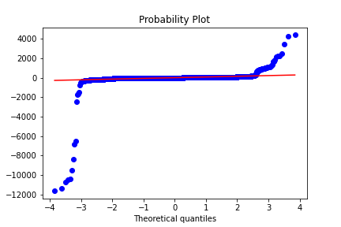

# Online Companion to "Risk-Averse Self-Scheduling of Storage in Decentralized Markets" 
The online companion to the publication

> O. Yurdakul and F. Billimoria, "Risk-Averse Self-Scheduling of Storage in Decentralized Markets," 
> submitted to 2023 IEEE Power & Energy Society General Meeting (PESGM), 2023.

This online companion contains
1. [The historical dispatch levels](#empirical-records-of-storage-dispatch-decisions) of storage resources bidding in the Australian National Electricity Market over a select group of days. These details, along with price forecast errors were sourced from the AEMO NEMWeb data repository ( https://nemweb.com.au/ ) using the data extraction and analysis packages NEMOSIS ( https://github.com/UNSW-CEEM/NEMOSIS ) and NEMSEER ( https://github.com/UNSW-CEEM/NEMSEER ). 
2. [Statistical test results](#statistical-test-results-on-forecast-errors) on the distribution of the pre-dispatch price forecast errors for different look-ahead periods
3. The [source code](/model), [input data](/input_files), and the [results](/solution_files) of the numerical studies presented in the publication

## Empirical records of storage dispatch decisions

The paper contains two case studies of storage self-commitment based on empirical data from the National Electricity Market (NEM).  Below we set out the empirical records of storage dispatch decisions and prices for the trading days considered in the main manuscript (primary case studies) as well as additional case studies that are indicative of similar phenomena with respect to self-commitment of storage units in decentralized markets (additional case studies). 

### Primary case studies

1. Victoria (VIC) - 12 June 2022 

The storage data of Case Study I uses that of the Victorian Big Battery (VBB), a grid-connected storage resource in the Australian state of Victoria with a charging/discharging power limit of 300.0 MW and an energy storage capacity of 450.0 MWh. Pre-dispatch prices in Victoria for June 12, 2022 are used, which constitutes the last day before the cumulative price threshold was exceeded in Victoria, triggering the onset of a series of market interventions that culminated in AEMO suspending the NEM on June 15, 2022. As per the empirical dispatch of the VBB on the day, it failed to discharge during a major price spike late in the trading day due to having to discharge early.

2. South Australia (SA) - 16 January 2019

Case Study II examines the battery dispatch for a day in which the pre-dispatch prices are highly volatile. Specifically pre-dispatch prices and dispatch are used for the 16th of January 2019 in South Australia. The case study uses storage data from that of the ESCRI storage resource, which is connected to the grid in South Australia and has a charging/discharging power limit of 30 MW and a capacity of 8 MWh.  Prices during this trading day were highly volatile, with sawtooth prices but mainly in positive territory. i.e. from positive prices to higher positive prices.

### Secondary case studies

Additional secondary case studies of empirical battery discharge, illustrative of risk-averse behaviour, are set out below. The full data set is provided [here](/input_files/price_params/Sample_days_conf_paper.xlsx). 

3. 4 Apr 2020 in South Australia - sawtooth price patterns creating difficulties in effectively scheduling storage units.

4. 15 Sep 20 in South Australia - 'duck curve' prices currently typical of South Australia with a strong evening peak. Storage units appear to have failed to dispatch ('missed the spike') during the high price period.

5. 21 Oct 22 in Queensland - A price spike during the middle of the day which the batteries missed, because they seemed to be discharging a few periods earlier.

6. 10 Sep 22 in Victoria - A trading day with periods of consistently flatter prices but again batteries discharged early and failed to wholly capitalize on price volatility.

7. 10 Aug 22 in Victoria - A rare price spike during the middle of trading day during which batteries failed to dispatch. The remainder of the trading day had predominatly flat prices.

## Statistical test results on forecast errors

To ascertain distributional information, a set of statistical tests were conducted on historical price forecast errors. Historical prices, both actual trading prices  and pre-dispatch forecast prices were sourced for the 2019 calender year extracted using NEMOSIS and NEMSEER (as above). Price forecast errors are calculated based on the methodology outlined in the manuscript.  

The plot below 

*The distribution of the forecast error with respect to the theoretical quantiles of the standard normal distribution*

