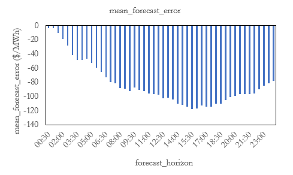

# Online Companion to "Risk-Averse Self-Scheduling of Storage in Decentralized Markets" 
The online companion to the publication

> O. Yurdakul and F. Billimoria, "Risk-Averse Self-Scheduling of Storage in Decentralized Markets," 
> in 2023 IEEE Power & Energy Society General Meeting (PESGM), 2023.

This online companion contains
1. [The historical dispatch levels](#empirical-records-of-storage-dispatch-decisions) of storage resources bidding in the Australian National Electricity Market over a select group of days. These details, along with price errors were sourced from the AEMO NEMWeb data repository ( https://nemweb.com.au/ ) using the data extraction and analysis packages NEMOSIS ( https://github.com/UNSW-CEEM/NEMOSIS ) and NEMSEER ( https://github.com/UNSW-CEEM/NEMSEER ). 
2. [Statistical test results](#statistical-test-results-on-forecast-errors) on the distribution of the pre-dispatch price errors for different look-ahead periods
3. The [source code](/model), [input data](/input_files), and the [results](/solution_files) of the numerical studies presented in the publication

## Empirical records of storage dispatch decisions

The paper contains two case studies of storage self-commitment based on empirical data from the National Electricity Market (NEM).  Below we set out the empirical records of storage dispatch decisions and prices for the trading days considered in the main manuscript (primary case studies) as well as additional case studies that are indicative of similar phenomena with respect to self-commitment of storage units in decentralized markets (additional case studies). 

### Primary case studies

1. Victoria (VIC) - 12 June 2022 

The storage data of Case Study I uses that of the Victorian Big Battery (VBB), a grid-connected storage resource in the Australian state of Victoria with a charging/discharging power limit of 300.0 MW and an energy storage capacity of 450.0 MWh. Pre-dispatch prices in Victoria for June 12, 2022 are used, which constitutes the last day before the cumulative price threshold was exceeded in Victoria, triggering the onset of a series of market interventions that culminated in AEMO suspending the NEM on June 15, 2022. As per the empirical dispatch of the VBB on the day, it failed to discharge during a major price spike late in the trading day due to having to discharge early.

2. South Australia (SA) - 16 January 2019

Case Study II examines the battery dispatch for a day in which the pre-dispatch prices are highly volatile. Specifically pre-dispatch prices and dispatch are used for the 16th of January 2019 in South Australia. The case study uses storage data from that of the ESCRI storage resource, which is connected to the grid in South Australia and has a charging/discharging power limit of 30 MW and a capacity of 8 MWh.  Prices during this trading day were highly volatile, with sawtooth prices but mainly in positive territory. i.e. from positive prices to higher positive prices.

### Secondary case studies

Additional secondary case studies of empirical battery discharge, illustrative of risk-averse behaviour, are set out below. The full data set is provided [here](/input_files/price_params/Sample_days_conf_paper.xlsx). 

3. 4 Apr 2020 in South Australia - sawtooth price patterns creating difficulties in effectively scheduling storage units.

4. 15 Sep 20 in South Australia - 'duck curve' prices currently typical of South Australia with a strong evening peak. Storage units appear to have failed to dispatch ('missed the spike') during the high price period.

5. 21 Oct 22 in Queensland - A price spike during the middle of the day which the batteries missed, because they seemed to be discharging a few periods earlier.

6. 10 Sep 22 in Victoria - A trading day with periods of consistently flatter prices but again batteries discharged early and failed to wholly capitalize on price volatility.

7. 10 Aug 22 in Victoria - A rare price spike during the middle of trading day during which batteries failed to dispatch. The remainder of the trading day had predominatly flat prices.

## Statistical test results on price errors

To ascertain distributional information, a set of statistical tests were conducted on historical price errors (defined as the actual dispatch price minus the predispatch price, for a given horizon). Historical prices, both actual dispatch prices and pre-dispatch forecast prices were sourced for the 2019 calender year extracted using NEMOSIS and NEMSEER (as above). Price errors are calculated based on the methodology outlined in the manuscript. 

The sample distribution of price error is shown below for the following horizons: 1 hour, 6 hours, 12 hours and 24 hours. 

The boxplot of price errors is shown below for all of the considered horizons (from 30 minutes ahead to 24 hours ahead).  It indicates in general that the distribution of forecast errors becomes significantly more spread with the forecast horizon. This supports the notion, unsurprisingly, that it is easier to make accurate forecasts accuracy nearer to real-time.

The plot below shows the first moment (mean) of the error distribution. For all horizons, the results show negative means. The magnitude of the first moment are relatively small at short horizons, but increase to levels ranging from around $80-120/MWh for horizon intervals beyond 5 hours. 

### Normality

A range of tests have been conducted for normality.  In other words, to understand the distribution of the forecast error with respect to the theoretical quantiles of the standard normal distribution.

**Skew and kurtosis** - A common test of normality is to examine the third and fourth moments of the distribution (skew and kurtosis), both of which should be zero for a normal distribution. As indicated in the plots below (skew - left and kurtosis - right) the sample distribution appears negatively skewed with positive kurotisis. The negative skew of the price error is of particular interest - indicating a higher occurence of the actual price being well below predispatch prices when the latter is high.  This supports the notion that the role of predispatch is not to forecast prices, but more accurately serves as a signal of potential scarcity.  In such conditions the high predispatch price would encourage generation resource to come online, thereby depressing the actual price outturn below that signalled by predispatch. The positive kurosis indicates that the distribution may have heavy tails.         

**Shapiro-Wilk test** The Shapiro-wilk test is indicator of normality in frequentist statistics (see https://en.wikipedia.org/wiki/Shapiro-Wilk_test). The plot below displays the W statistic, which is more reliable than the p-value for sample  greater than 5000 we use the W statistic (rather than p-value).  In each of the horizons, the W-statistic indicates that the null hypothesis can be rejected, is is evidence that the sample data is not normally distributed.

**Kolmogorov-Smirnov test** The Kolmogorov-Smirnov test is another distribution agnostic test of the distance between the empirical and proposed distribution (see https://docs.scipy.org/doc/scipy/reference/generated/scipy.stats.kstest.html).  Here too the test statistics indicate that the null hypothesis of normality can be rejected. 

Finaly we also undertake probability plots to check against normality (available at https://github.com/oyurdakul/pesgm23/tree/main/stats/stats_24/results/plots). In each case it is apparent that the price forecast error of pre-dispatch ahead prices against real time prices is non-normal displaying notable negative skew and kurtosis. The probability plot is also instructive indicating that normality assumption breaks down particularly at the extreme quantiles.  An example probability, for a 1 hour ahead horizon is provided below.

The overall results are not surprising for predispatch as it is actually meant as a price signal rather than a price-forecast. In other words, predispatch is intended to signal to participants how to change their behaviour - for example if predispatch prices are high, it indicates more participants should committ into the market.  Therefore even 30 mins ahead (when flexible resources can still committ) we expect there will be significant price errors, which shows out in the statistical analysis. The positive kurtosis, as indicators of heavy tails, suggest it may be easier to forecast prices most of the time, but that signifcant forecast errors are possible in the extreme.

### Dependence

Tests have also been run for independence of observations as between forecast horizons. This is indicative of whether a joint distribution is applicable, or whether independent distribution functions can be adopted. 

**Pearson and Spearman-rank correlation** matrices are provided below for forecast horizons ranging from 0.5 hrs to 24 hrs. Green indicates a correlation of 1.0, yellow indicates a correlation of 0.5 and orange indicates a correlation of 0.  The full data and f-test results are provided at the following location https://github.com/oyurdakul/pesgm23/tree/main/stats/stats_24/results. The correlation matrices for both Pearson and Spearman suggest high correlations between adjacent horizons (generally within 1-2 hours of the considered horizon). Beyond such periods, lower correlations are observed.

**Mutual information tests of dependency** are also conducted with similar observations (results are provided at the following location https://github.com/oyurdakul/pesgm23/tree/main/stats/stats_24/results/error_mut_info.csv) that the dependence is significant towards at closer intervals however as the interval between the predispatch horizons expand the dependency reduces.  Once again, this is not surprising because it depends upon the ahead forecasts of system conditions, which can change significantly as new information becomes available closer to time. 

Overall, based on the statistical analysis, there are two important implications.  First that multiple statistical tests suggest that the distribution of price errors for the range of considered horizons are statistically significantly different from a normal Gaussian distribution. In particular the potential for extreme deviations suggests that the distributions may have heavier tails.  Second, that there appears to be strong dependence especially for near-to-real-time timeframes and adjacent forecast horizons.  This suggests it may be difficult to justify the use of independent cumulative density functions, cdf (or probability density functions, pdf) for the purposes of modelling storage self-committment. For this reason, we use the sample distribution for the the stochastic parameters of the risk-averse optimization for storage self-commitment. 
